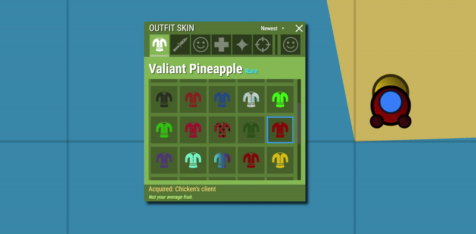

# chickenPoo's amazing desktop survev client
my own custom survev client aiming to be better than all others :o
- **Made by [chickenPoo](https://github.com/chickenpoo351)**
- **Small Note:** I would really appreciate if you starred the repo if it brought any value to you each star is a bit more motivation for me to continue working on this thanks for reading :D
- **Other Small Note:** This repo is specifically for the desktop wrapper version of my survev.io client understandably though this version has deeper access to your PC which might scare some of you off if you do not trust the desktop version you can download the chrome extension version in the other repo

---

## Why would you need this?

well you really dont but its cool to have currently it gives you 
- **Custom Skins** so you can personalize your character like no other client :D
- **It's A Desktop Wrapper!** so you no longer have to open up your browser to play the game just launch the application :D
- And I'm pretty sure this is a **one of kind** survev.io client in more ways than one so thats cool too :D

but more features are on the way :D

here's some cool previews showing off the skin Valiant Pineapple

---

<h3>Loadout preview</h3>

<h3>In-game preview</h3>

## Installation Guide

---

# Important! Read This First

so to temper your expectations I need to get three things out of the way those being

1. This only works on Windows because well I dont have a Linux or macOS machine to test if this would even work...

2. Upon either downloading, installing, or running Windows might yell at you with smartScreen saying something along the lines of 

"Windows just protected your PC"

I know that sounds scary but there really isnt any risk Windows simply does that because the code isnt signed with one of their fancy $100 a year certificates (even then some newly signed apps still get warned about so more than likely you may see this warning) also if you dont believe me you can look at the code it is opensource... and either way if your uncomfortable with that just use the extension version

3. **You cant login** ... yea its that simple

**But** if anyone has any ideas on how this can be done please do let me know you can open a PR or issue or whatever I would really appreciate any help you all could provide on this (and also anything else)

(well technically I havent fully tested it but based on everything ive seen of how the login stuff works it literally just wont work)

 there is practically nothing I can do about that unless I controlled the login stuff of survev.io (which I dont...) so alas you have to play as a guest unless a fix is found that my goofy brain missed lol

Anyway though if you dont care / understand all of this then continue setup is simple

Extension version repo link in case you feel uncomfortable downloading and using this

[**Click Me To Go To The Extension Repo!**](https://github.com/chickenpoo351/chickenPoo-Amazing-Survev-Client)

---

## Step One

1. Download the exe from the release section

2. run the exe it will promptly install the application and launch it

3. Like I said above you might get the smartScreen "Windows just protected your PC" warning if that happens just click the "More info" text and then click the run anyway button (note: like I said if your uncomfortable or something with this just use the extension version or if you can code you can read the source yourself in this repo and verify nothing spooky is going on and if you want to go the extra step you can just download the whole repo and build the installer yourself in case you for some reason suspect some code spoofing is going on :o) 

## Important
I know your probably itching to try out the application but please keep reading I dont want random issues being opened because little timmy thought this does something it didnt and now he's going to make an issue in all caps saying something like 

> "**FIX THIS IT DOES NOT DO (random thing the application was never meant to do)**"

---

## FAQ

**Q: Do the skins show for other people?**
A: **No** they do not but that shouldnt matter I mean if you can see it who cares if anyone else can (plus theres only two skins in the loadout right now so this has to be better than that)

---

**Q: Does this application do (insert random feature that wasnt listed at the top)?**
A: **No** unless its listed at the top it does not do this

---

**Q: Why doesnt it work after a update?**
A: this happens because after a update the file names and variables of the game are moved around please be patient after a update I will go as fast as I can to fix it in the meanwhile though the game should still work once I do push a update though it should be promptly auto updated to your application

---

**Q: Is this some type of hack?**
A: **No** this application will never have any type of hacking capabilities due to the fact I am actualy a decent human being and there should never be a need to hack in a game in the first place let alone a browser game... (not to mention thats a pretty good way to get malware... but I guess if your not deterred from using hacks in this message nothing will... well maybe getting banned from survev will...)

---

**Q: Does this make me cooler than my friends?**
A: **Yes** it makes you unimaginably cooler than your friends (your welcome :D)

---

**Q: I found a bug! what do I do now?**
A: Easy just report it here on github and I will fix it when I get around to it

---

**Q: Will this get me banned from survev.io?**
A: **Nope** at least it shouldnt but if a mod bans you for looking too stylish sorry I guess...

---

**Q: Does this work on (insert whatever non-Windows OS you are using)?**
A: **Sadly no...** like I said before I dont have a macOS or Linux machine to test if this would work so for now (and probably for the foreseeable future) it will only be available for Windows

---

**Q: Can this run on my toaster?**
A: Of course it can provided you can download files on it and it runs Windows

---

**Q: How do I remove the application?**
A: Easy you simply go to wherever you have the application shortcut at then follow these steps
1. Right click the shortcut then click "open file location..."
2. You should now be in your file explorer and inside the folder that contains the application
3. Now simply look for a "uninstall.exe", run it, wait a minute or so, and there you go the application is uninstalled

(although why would have a need to uninstall? surely its not because the client is so absolutely amazing)

---

**Q: Can I contribute to this by making my own custom skin?**
A: Of course! I would love if you came up with your own custom skin and contributed to the extension please refer down to the contributing section for information on how to do so

---

- Thats it for now if you have a question you simply can't think of the answer for then feel free to open a issue just make sure your not being a little timmy...

## How to Contribute

---

Whats that? You want to make your own custom skin and have it added to the extension? Thats great! keep reading to figure out how you can do this

(im still working on the instructions for this please be patient until I make them then you can start contributing :D)

---

## Repacking the Application

---

Hold on a minute little timmy I know you want to make your own application and thought it was probably a good idea to just clone this one and add a few things right?

well I have no problem against that as long as your not simply cloning the application and giving it a different name then saying you made it... that's sad I spent a lot of time working on this...

if you do clone this to make your own application I would very much appreciate if you gave me credit and linked back to this repo thanks :D

---

## Wow, You Made It This Far?

Thank you for reading this hopefully all your questions and other stuff have been answered enjoy the application more features will be on the way!