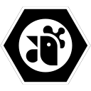
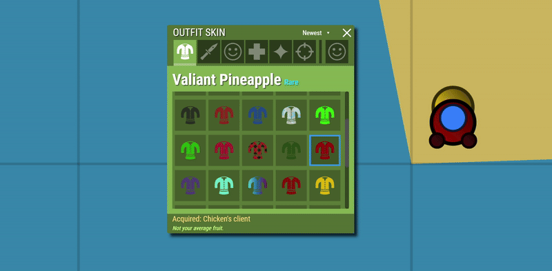

# Survev.io Desktop Client

This Survev.io desktop client is a custom standalone desktop wrapper for Survev.io that allows players to use custom skins in-game and enjoy a browser-free, application-based experience. Unlike the standard web version, this open-source Survev client runs as a dedicated desktop application for improved convenience, performance, and customization.

(*cough* *cough* ~~enough github SEO farming lol~~ *cough*)

## chickenPoo's Amazing Desktop Survev Client

My own custom desktop Survev.io client aiming to be better than all others :o

- **Made by [chickenPoo](https://github.com/chickenpoo351)**
- If you enjoy the project, please do consider starring the repo it helps more than you think thanks :D
- This repo is **specifically for the desktop version of the Survev.io client** click [here](https://github.com/chickenpoo351/chickenPoo-Amazing-Survev-Client) for the chrome extension version

## Why would you need this?

I'm glad you asked! Here are the current capabilities of the client
- **Custom Survev Skins** so you can personalize your character like no other Survev.io client
- **It's A Desktop Wrapper!** so you no longer have to open up your browser to play the game just launch the application
- And I'm pretty sure this is a **one-of-a-kind** Survev.io client in more ways than one so thats cool too!

More features are on the way :D

here's some cool previews showing off the skin Valiant Pineapple:

## Previews

<h3 align="center">Loadout preview</h3>

<h3 align="center">In-game preview</h3>

## Installation

### Important! Read This First

Before installing, please be aware of the following:

- This client currently only supports running on Windows machines

- SmartScreen - upon installation of the client you may see a warning pop up thats something like this "Windows protected your PC". This happens because the application is considered new and not signed to Windows Defender. The project is open source, so you are free to review its code or build it yourself if you like

- Login support - Discord login works, however Google login does not currently work. if you have ideas as to how to fix the Google login, please feel free to open a issue or PR. Until then Discord login is the only way you can login.

If you prefer a browser based option, then click the link below for the extension version repo

[**Click Me To Go To The Extension Repo!**](https://github.com/chickenpoo351/chickenPoo-Amazing-Survev-Client)

## Installation Steps

1. Download the `.exe` from the release section (**Note:** Only download the `.exe` file. The `.exe.blockmap` and `latest.yml` files are used for auto-updates and are not needed for manual installation.)

2. Run the installer it will automatically set itself up and launch the application

3. If you see the SmartScreen warning:
    - Click **More Info**
    - Click **Run Anyway**

## Before Reporting an Issue

Before opening an issue, please try the following:

- Read the FAQ

- Make sure the issue isn’t caused by a misunderstanding of the listed features. (Feature suggestions are always welcome.)

- Confirm the problem isn’t due to a recent Survev.io update. After major updates, it may take up to a day for the client to be updated.

If the issue persists, please feel free to open a report with clear details of what's happening.

## FAQ

**Q: Do the skins show for other people?**
**A**: **No.** Skins are client side only, meaning only you can see them

---

**Q: Does this client do (insert random feature that wasnt listed at the top)?**
**A**: **No** unless its listed at the top it does not do this

---

**Q: Why doesn't it work after a Survev.io update?**
**A**: Survev.io updates sometimes change file names and internal variables. When that happens, the client may temporarily break. Updates are usually pushed within about a day.

---

**Q: Is this some type of hack or cheat client?**
**A**: **No.** This client does not include and will never include hacking or cheating features. It is purely cosmetic and quality-of-life focused. (And also side note: why would you cheat in a game? let alone a browser game lol)

---

**Q: Does this make me cooler than my friends?**
**A**: **Yes** it makes you unimaginably cooler than your friends (your welcome :D)

---

**Q: I found a bug! what do I do now?**
**A**: Easy just report it here on github and I will fix it when I get around to it

---

**Q: Will this get me banned from survev.io?**
**A**: **Nope** at least it shouldn't but if a mod bans you for looking too stylish sorry I guess... (I should probably clarify at the risk of ruining the joke... there is literally close to zero chance you get banned for using this unless for whatever reason the Survev.io team decides to just get rid of all third-party clients)

---

**Q: Does this work on (insert whatever non-Windows OS you are using)?**
**A**: **Sadly no...** This version currently only supports machines using Windows

---

**Q: Can this run on my toaster?**
**A**: Of course it can provided you can download files on it and it runs Windows

---

**Q: How do I remove the application?**
**A**: Easy you simply go to wherever you have the application shortcut at then follow these steps
1. Right click the shortcut then click "open file location..."
2. You should now be in your file explorer and inside the folder that contains the application
3. Now simply look for a "uninstall.exe", run it, wait a minute or so, and there you go the application is uninstalled

(although why would have a need to uninstall? surely its not because the client is so absolutely amazing)

---

**Q: Can I contribute to this by making my own custom skin?**
**A**: Of course! I would love if you came up with your own custom skin and contributed to the extension please refer down to the contributing section for information on how to do so

## How to Contribute

Whats that? You want to make your own custom skin and have it added to the extension? Thats great! keep reading to figure out how you can do this

(im still working on the instructions for this please be patient until I make them then you can start contributing :D)

## Repacking / Forking

You are free to fork or modify this project.

If you create your own version, I would very much appreciate if you provided proper credit and linked back to this repo

Thanks!

## Wow, You Made It This Far?

Thank you for reading this hopefully all your questions and other stuff have been answered enjoy the client more features will be on the way!